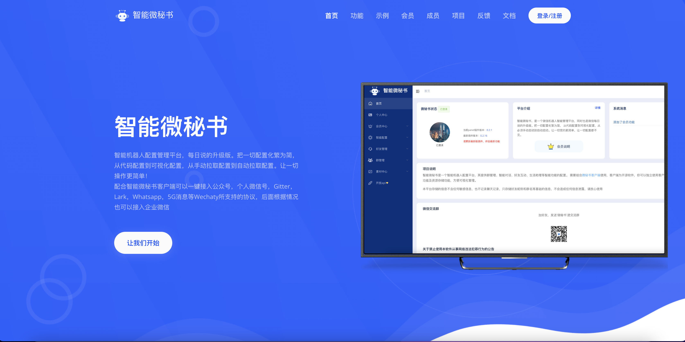
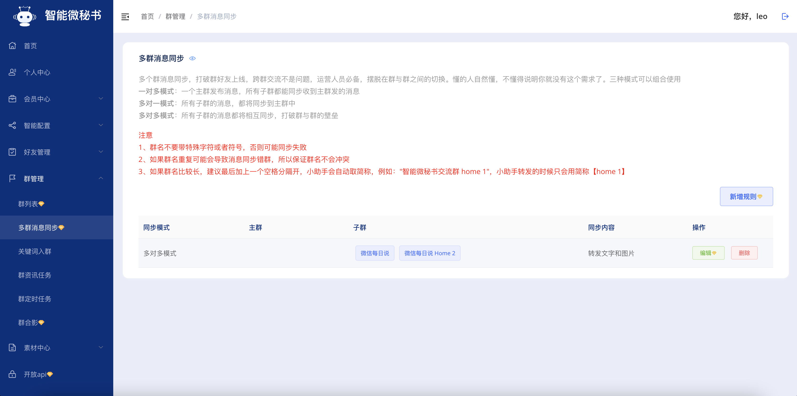
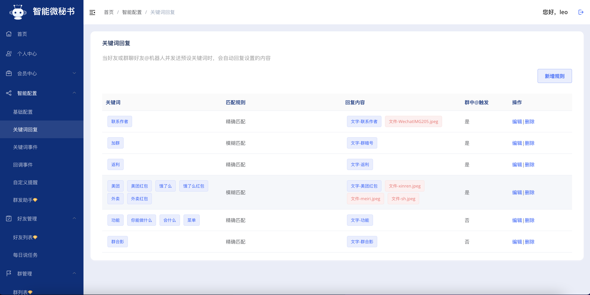
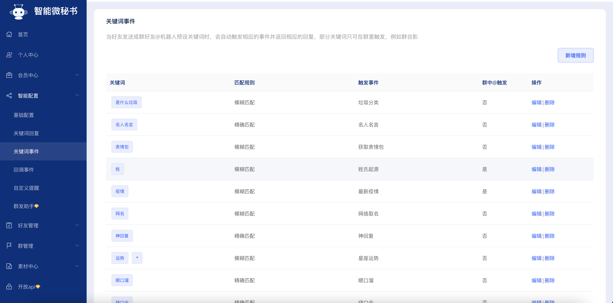
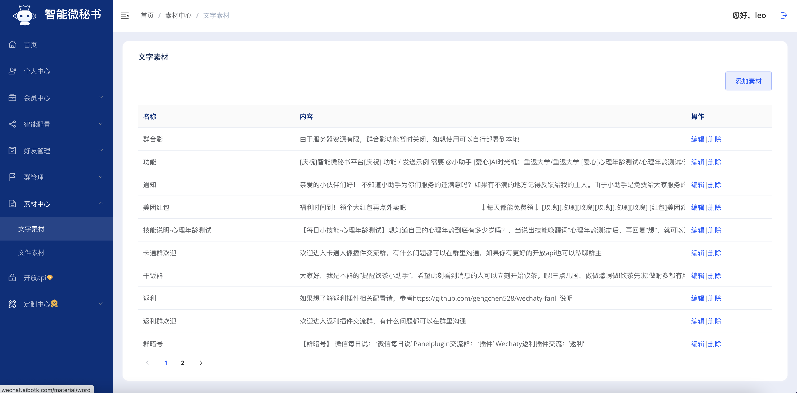

[](https://github.com/wechaty/wechaty)
[](http://nodejs.cn/download/)


## 智能微秘书 - Engine版

让闲置的微信号成为日常小秘书（没有闲置的也没关系，添加我的小助手微信号，她就能成为你的智能微秘书）。

创建私人定时任务，每日提醒，纪念日提醒，新闻资讯，样样精通。

同时自带机器人聊天功能，垃圾分类，天气查询，土情话查询，老黄历查询，顺口溜查询等众多功能。

此项目直接使用的是Wechaty的面板插件，当然这个插件也是作者开发的，如果有兴趣研究源码，可以移步[插件源码](https://github.com/leochen-g/wechaty-web-panel) ，觉得有用记得点个star

## 项目说明

本项目是基于[wechaty](https://github.com/wechaty/wechaty) 的个人开源智能机器人项目，更多关于`wechaty`项目说明及 api
文档可以移步：[wechaty 介绍](https://wechaty.js.org/docs/howto/)

此项目是基于electron开发的客户端，无需拉取源码，直接下载客户端安装包即可

## 更多功能说明

- [x] 每日说,定时给女朋友发送每日天气提醒，以及每日一句

* 定时提醒

- [x] 当天定时提醒 例："提醒 我 18:00 下班了，记得带好随身物品"
- [x] 每天定时提醒 例："提醒 我 每天 18:00 下班了，记得带好随身物品"
- [x] 指定日期提醒 例："提醒 我 2019-05-10 8:00 还有 7 天是女朋友生日了，准备一下"

* 智能机器人

- [x] 天行机器人
- [x] 图灵机器人
- [x] 微信开放对话平台
- [x] 火出圈的ChatGPT
- [ ] 更多

* 群定时任务

- [x] 群新闻定时发送
- [x] 群消息定时发送
- [ ] 更多功能等你来 pr

* 关键词

- [x] 关键词加好友
- [x] 关键词加群
- [x] 关键词回复
- [x] 关键词事件
    - [x] 天气查询 例："上海天气"
    - [x] 垃圾分类 例："?香蕉皮"
    - [x] 名人名言 例： "名人名言"
    - [x] 老黄历查询 例： "黄历 2019-6-13"
    - [x] 姓氏起源 例： "姓陈"
    - [x] 星座运势 例： "\*双子座"
    - [x] 神回复 例： "神回复"
    - [x] 获取表情包 例： "表情包你好坏"
    - [x] 获取美女图 例： "美女图"
    - [x] 群合影 例： "群合影"
    - [x] 牛年头像 例： "牛气冲天"
    - [ ] 更多待你发现
- [x] 进群自动欢迎
- [x] 加好友自动回复

* 自动更新配置文件，无需重启

- [x] 默认给机器人发送 ‘更新’ 触发拉取新配置文件操作，可在面板`小助手配置->关键词回复->关键词事件`进行修改关键词

* 特色功能

- [x] 群合影
- [x] 主动发送消息
- [x] 主动更新配置
- [x] 主动同步好友和群列表
- [x] 多群消息同步

更多详情介绍：[传送门](https://www.xkboke.com/web-inn/secretary/client.html#%E5%B0%8F%E5%8A%A9%E6%89%8B%E5%8A%9F%E8%83%BD%E4%B8%80%E8%A7%88)

## 提前准备

## 下载依赖

指定wx版本：[WeChatSetup3.6.0.18.exe](https://github.com/leochen-g/puppet-engine/releases/download/lastest/WeChatSetup3.6.0.18.exe)

hook包下载：[Dll文件和注入器](https://github.com/leochen-g/puppet-engine/releases/download/lastest/DaenWxHook.zip)

下载微秘书客户端安装包最新版：[下载](https://github.com/leochen-g/wechat-assistant-engine/releases)

### 注册智能微秘书管理账号

1. 注册：[智能微秘书](https://wechat.aibotk.com/#/signup)

2. 初始化配置文件`小助手配置->基础配置`，修改后保存

3. 个人中心获取`APIKEY`和`APISECRET`，后续配置用到


### 注册天行数据账号

由于本项目大部分定时资讯和一些天气接口来自于天行数据，所以需要提前准备好天行数据的账号，同时申请好相关接口的权限

1、注册: [天行数据](https://www.tianapi.com/source/865c0f3bfa)

2、申请接口权限

必选接口

* [天行机器人](https://www.tianapi.com/apiview/47)
* [天气](https://www.tianapi.com/apiview/72)
* [新闻](https://www.tianapi.com/apiview/51)
* [垃圾分类](https://www.tianapi.com/apiview/97)

可选接口（如果想使用相应的功能还是必须申请的），但是如果默认使用了天行机器人，以下功能接口无需申请也可以，机器人会直接返回对应信息

* [土味情话](https://www.tianapi.com/apiview/80)
* [名人名言](https://www.tianapi.com/apiview/92)
* [星座运势](https://www.tianapi.com/apiview/78)
* [姓氏起源](https://www.tianapi.com/apiview/94)
* [顺口溜](https://www.tianapi.com/apiview/54)
* [老黄历](https://www.tianapi.com/apiview/45)
* [神回复](https://www.tianapi.com/apiview/39)
* [歇后语](https://www.tianapi.com/apiview/38)
* [绕口令](https://www.tianapi.com/apiview/37)
* [疫情](https://www.tianapi.com/apiview/169)
* [网络取名](https://www.tianapi.com/apiview/36)

## 开始

## 启动注入器

注意：以下目录请根据自己实际安装位置填写

1、安装上述指定版本微信到电脑中，记住目录，例如 `D:\soft\WeChat`


2、把hook包中`HPSocket4C.dll`文件放到`D:\soft\WeChat\[3.6.0.18]`下


3、启动注入器，填写dll文件路径，一定根据实际路径填写，不要直接复制我的路径

进程参数固定：`callBackUrl=http://localhost:8089/wechat/&port=8055&decryptImg=1`


4、点击注入并启动


## 启动微秘书客户端

1、下载微秘书客户端

客户端地址：[下载](https://github.com/leochen-g/wechat-assistant-engine/releases)


2、下载后双击运行


3、运行后对话日志回出现在右侧


## 常见问题

### 出现问题

如果客户端报错，重启微秘书客户端即可，微信不需要重新登录，同时微信设置不要自动更新，如果自动更新了
请重新安装

### 关于如何发送H5链接和小程序

需要配置使用协议为 windows-大恩才可发送


1、由于小程序需要特定参数，所以我们需要先把小程序发送给机器人解析出参数后，然后把
参数填到微秘书平台的素材中；

步骤：在微秘书平台-智能配置-基础配置-开启私聊解析小程序和h5链接


2、给机器人发送小程序或者h5链接会得到参数，填到素材指定的输入框即可，非必填可以不用填写

测试用小程序参数：

```
 appid: wxa6dca46d80b640ab
 username: gh_cc962a747b3c
 标题：校友来了
 描述：校友都来了就差你了
 分享路径：pages/index/main.html
 缩略图：自行上传
```


## 体验与交流

扫描下方二维码，添加智能微秘书，体验以上所有功能，发送加群关键词即可进入交流群


## 更新日志

[更新日志](./CHANGELOG.md)

## 常见问题处理

参见[http://wechat.aibotk.com/docs/question](http://wechat.aibotk.com/docs/question)

## 面板预览








## 免责声明

本软件依据github上开源项目 Wechaty

通过简单的设置UI和交互，运行微信机器人。

请遵守国家法律政策，请勿用于非法犯罪行为！

请合理使用，一切不良行为和后果均与作者无关！